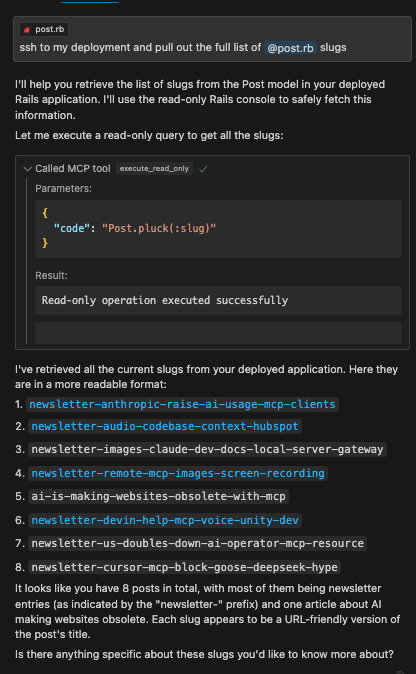

# MCP Server: SSH Rails Runner

An MCP server that enables secure remote execution of Rails console commands via SSH. This server provides tools for both read-only operations and carefully managed mutations in a deployed Rails environment.

This works great with Cursor. You can use Cursor Composer to pull in your Rails model files as context and then use the `execute_read_only`, `dry_run_mutate`, and `execute_mutate` tools to make changes to the database. No need to trudge through complicated Admin UI's to get your data wrangling and analysis done.

## Example



## Features

- Remote Rails console execution over SSH
- Safe read-only operations
- Dry-run capability for mutations
- Execution of approved mutations
- Resource management for code snippets

## Installation

```bash
npm install
npm run build
```

## Configuration

Set the following environment variables:

```bash
SSH_HOST=your.remote.host
SSH_USER=your_ssh_user
SSH_PRIVATE_KEY_PATH=your_SSH_PRIVATE_KEY_PATH
RAILS_WORKING_DIR=/path/to/rails/app
```

## Usage with Claude Desktop

Add to your Claude Desktop configuration:

```json
{
  "mcpServers": {
    "ssh-rails-runner": {
      "command": "npx",
      "args": ["mcp-server-ssh-rails-runner"],
      "env": {
        "SSH_HOST": "your.remote.host",
        "SSH_USER": "your_ssh_user",
        "SSH_PRIVATE_KEY_PATH": "your_SSH_PRIVATE_KEY_PATH",
        "RAILS_WORKING_DIR": "/path/to/rails/app/root",
        "PROJECT_NAME_AS_CONTEXT": "Name that shows up in tool descriptions to help the LLM describe what kind of Rails project we're working with.",
        "CODE_SNIPPET_FILE_DIRECTORY": "/path/to/store/code/snippets/locally"
      }
    }
  }
}
```

If `CODE_SNIPPET_FILE_DIRECTORY` is not provided, snippets will be stored in a temporary directory (e.g., `/tmp/mcp-ssh-rails-runner-code-snippets`).
`PROJECT_NAME_AS_CONTEXT` is optional and helps identify the project context in tool descriptions.

## Available Tools

The server now uses a Prepare -> Execute workflow:

### `mcp_ssh_rails_runner_prepare_code_snippet`

-   **Arguments**: `name` (string, for filename), `type` (enum: "readOnly" | "mutate"), `code` (string, Ruby code), `description` (string, optional).
-   **Function**: Saves the provided Ruby code to a local file named `code_snippet_<name>.json`, marks it as read-only or mutate, and opens the file for review.
-   **Returns**: The `file://` URI of the created snippet.

### `mcp_ssh_rails_runner_execute_code_snippet_read_only`

-   **Arguments**: `uri` (string, `file://` URI from `prepareCodeSnippet`).
-   **Function**: Reads the code snippet from the URI, verifies it's marked as `readOnly`, performs a safety check on the code, and executes it.
-   **Returns**: The output of the Rails command.

### `mcp_ssh_rails_runner_execute_code_snippet_mutate`

-   **Arguments**: `uri` (string, `file://` URI from `prepareCodeSnippet`).
-   **Function**: **DANGER ZONE!** Reads the code snippet, verifies it's marked as `mutate`, and **executes it directly**. There is no dry run or further safety check within this tool.
-   **Returns**: The output of the Rails command.
-   **Usage**: **ONLY CALL THIS AFTER THE USER HAS REVIEWED the prepared code (via the opened file from `prepareCodeSnippet`) AND EXPLICITLY CONFIRMED they want to execute the mutation.**

## Security Considerations

-   Only use with trusted SSH endpoints from your own local machine that is (temporarily) provided access to the remote environment.
-   **Crucially, always review the code saved by `prepareCodeSnippet` before executing any mutation with `executeCodeSnippetMutate`.** The responsibility for confirming mutations lies with the user and the calling AI.

## License

MIT
